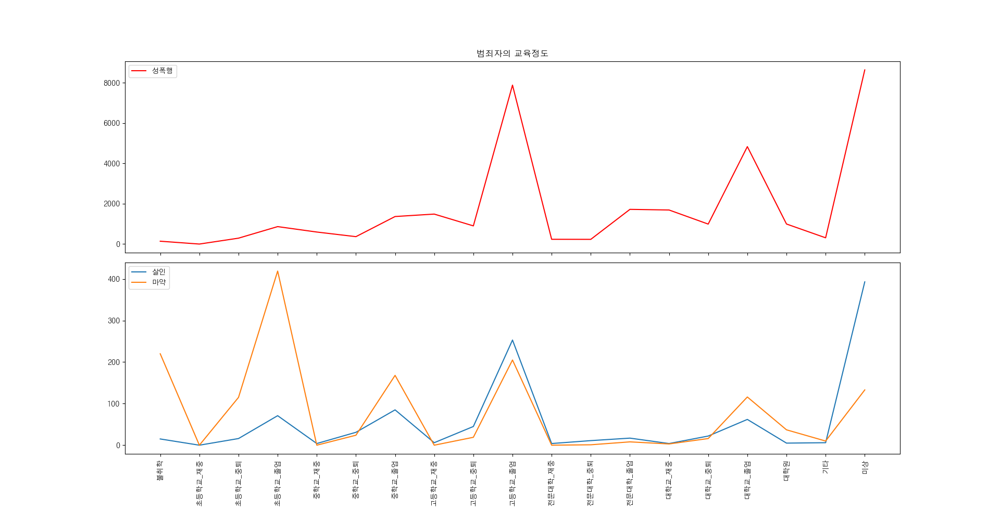
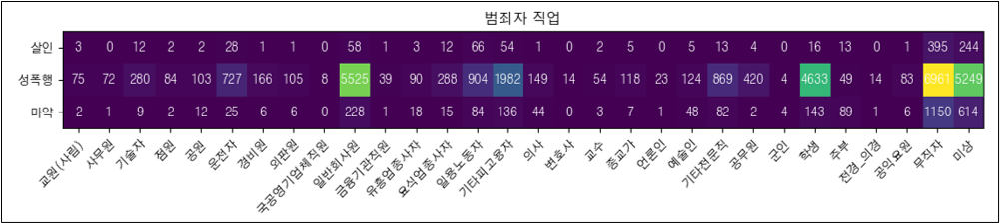
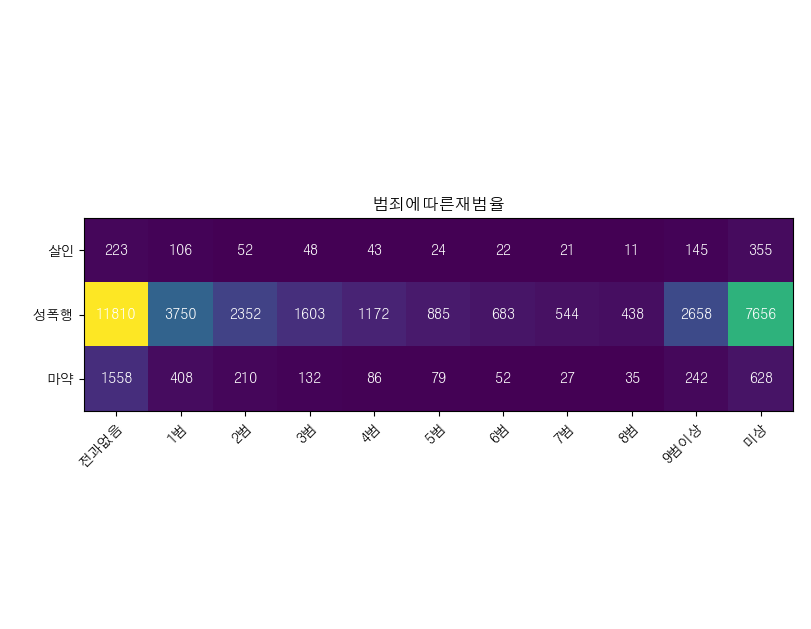
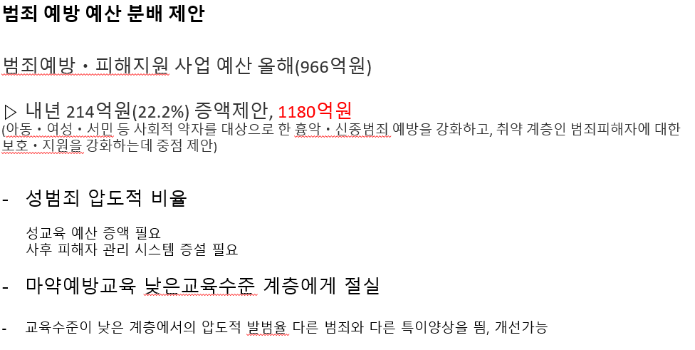

# 범죄 예방 예산 분배 제안서

▶ 범죄 유형 선정
-    살인, 성폭력, 마약(대마+마약)

▶ 범죄자 프로파일
-    학력별 범죄율
-    직종별 범죄율

▶ 범죄에 따른 재범률
-    살인, 성폭력, 마약(대마+마약)

▶ 범죄 예방 예산 분배 제안

* * *

▶ 학력별 범죄율 분석



▷ 특이양상 - 마약관련범죄에서는 초등학교 졸업 학력수준의 범죄자가 압도적인 비율을 차지함    
		       (이외의 범죄에서는 초등학교 졸업 학력수준 범죄자의 범죄율은 평이함)           
		        - 성폭행범죄에서는 고등학교 졸업 학력수준의 범죄자가 압도적인 비율을 차지함


``` python
import matplotlib.pyplot as plt
import numpy as np
import csv
from matplotlib import font_manager, rc
font_path = "C:\Windows\Fonts\H2GTRM.TTF"
font = font_manager.FontProperties(fname=font_path).get_name()
rc("font", family = font)
with open(r"C:\Users\A15\Downloads\범죄자_교육정도_2019.csv",encoding="cp949") as f:
    data = csv.reader(f)
    a = []
    sort_edu = []
    for i in data:
        # print(i)
        a.append(i)
    for i in range(len(a[0])):
        sort_edu.append(a[0][i])
# i[1] i[16]부터
# print(type(data))
kill = a[1][:]
kill1 = []
assult = a[2][:]
assult1 = []
drug = a[4][:]
drug1 = []
sort_edu.remove("범죄분류")
assult.remove("성폭력")
kill.remove("살인")
drug.remove("마약류관리에관한법률(마약)")
for i in kill:
    kill1.append(int(i))
for i in assult:
    assult1.append(int(i))
for i in drug:
    drug1.append(int(i))
# print(drug)
# print(kill)
# print(drug)
# print(sort_edu)
# print(a)
print(type(kill))
# y = [a[1][0],a[2][0],a[5][0]]
# count = [kill]
x = np.arange(0,19,1)
# print(count)
# print(len(kill))
# print(sort_edu)
fig, (ax1, ax2) = plt.subplots(2,1, sharex=True)
fig.subplots_adjust(hspace=0.05)
# ax1.plot(x,kill1,label="살인")
ax1.plot(x,assult1,c ="red", label="성폭행")
# ax1.plot(x,drug1, label="마약")

ax2.plot(x,kill1,label="살인")
# ax2.plot(x,assult1,label="성폭행")
ax2.plot(x,drug1, label="마약")

# ax1.set_ylim(700, 10000)
# ax2.set_ylim(0, 500)

# ax1.spines["bottom"].set_visible(False)
# ax2.spines["top"].set_visible(False)
# ax1.xaxis.tick_top()
# ax1.tick_params(labeltop=False)
# ax2.xaxis.tick_bottom()

# kwargs = dict(marker=[(-1, -0.5), (1, 0.5)], markersize=12,
#               linestyle="none", color='k', mec='k', mew=1, clip_on=False)
# ax1.plot([0, 1], [0, 0], transform=ax1.transAxes, **kwargs)
# ax2.plot([0, 1], [1, 1], transform=ax2.transAxes, **kwargs)
# ax1.xticks(x, sort_edu, rotation=45)

# plt.plot(x,kill1,label="살인")
# plt.plot(x,assult1,label="성폭행")
# plt.plot(x,drug1, label="마약")
plt.xticks(x, sort_edu, rotation=90)
ax1.set(title='범죄자의 교육정도')
ax1.legend()
plt.legend()
plt.show()

```

▶ 직종별 범죄율 분석



▷ 특이양상 - 마약관련범죄에서는 일반회사원(기타피고용자), 학생, 무직자 직종에서 많은 비율을 차지함    
		- 성폭행범죄에서는 일반회사원(기타피고용자), 학생, 무직자 직종에서 압도적인 비율을 차지함     
		- 성폭행범죄에서는 권력체계가 확실한 직종 (교수, 종교가, 공무원) 의 범죄비율이      
		  다른 범죄의 비율과 눈에 띄는 차이가 있음 

``` python
import csv
import matplotlib.pyplot as plt
import numpy as np
from matplotlib import font_manager, rc
f = open(r"C:\Users\A15\Downloads\범죄자_직업_2019.csv",encoding='euc-kr')
data = csv.reader(f)
font_path = "C:\Windows\Fonts\H2GTRM.TTF"
font = font_manager.FontProperties(fname=font_path).get_name()
rc("font", family = font)

results = np.array([[3,0,12,2,2,28,1,1,0,58,1,3,12,66,54,1,0,2,5,0,5,13,4,0,16,13,0,1,395,244],
                    [75,72,280,84,103,727,166,105,8,5525,39,90,288,904,1982,149,14,54,118,23,124,869,420,4,4633,49,14,83,6961,5249],
                    [2,1,9,2,12,25,6,6,0,228,1,18,15,84,136,44,0,3,7,1,48,82,2,4,143,89,1,6,1150,614]])

crime = ['살인','성폭행','마약']
job = []

for i in data:
    if '범죄분류' in i[0]:
        for x in i[1:]:
            job.append(x)
        print(job)

fig, ax = plt.subplots()
im = ax.imshow(results)

ax.set_xticks(np.arange(len(job)))
ax.set_xticklabels(job)

ax.set_yticks(np.arange(len(crime)))
ax.set_yticklabels(crime)

plt.setp(ax.get_xticklabels(), rotation=45, ha="right",
         rotation_mode="anchor")

for i in range(len(crime)):
    for j in range(len(job)):
        text = ax.text(j, i, results[i, j],
                       ha="center", va="center", color="w")

ax.set_title("범죄자 직업")
fig.tight_layout()
plt.show()


```

* * *

범죄에 따른 재범율



▶ 범죄유형에 따른 재범횟수 분석

▷ 특이양상 - 전반적인 재범의 비율이 5범 수준에서 줄어드는 것이 특징적임     
		- 살인범죄유형은 ‘1범’보다 ‘9범이상’이 유일하게 높은 범죄유형임     
              - 마약범죄유형의 ‘전과없음’은 다른유형의 재범율보다 현저히 낮음     
		  (집행유예 관련 예상)  


``` python
import csv
import matplotlib.pyplot as plt
import numpy as np
from matplotlib import font_manager, rc
f = open(r"C:\Users\A15\Downloads\범죄자_전과_2019.csv",encoding='euc-kr')
data = csv.reader(f)
font_path = "C:\Windows\Fonts\H2GTRM.TTF"
font = font_manager.FontProperties(fname=font_path).get_name()
rc("font", family = font)

results = np.array([[223,106,52,48,43,24,22,21,11,145,355],[11810,3750,2352,1603,1172,885,683,544,438,2658,7656],[1558,408,210,132,86,79,52,27,35,242,628]])

crime = ['살인','성폭행','마약']
num = []

for i in data:
    if '범죄분류' in i[0]:
        for x in i[1:]:
            num.append(x)
        print(num)

fig, ax = plt.subplots()
im = ax.imshow(results)

ax.set_xticks(np.arange(len(num)))
ax.set_xticklabels(num)

ax.set_yticks(np.arange(len(crime)))
ax.set_yticklabels(crime)

plt.setp(ax.get_xticklabels(), rotation=45, ha="right",
         rotation_mode="anchor")

for i in range(len(crime)):
    for j in range(len(num)):
        text = ax.text(j, i, results[i, j],
                       ha="center", va="center", color="w")

ax.set_title("범죄에따른재범율")
fig.tight_layout()
plt.show()
```

* * *

▶ 범죄 예방 예산 분배 제안



